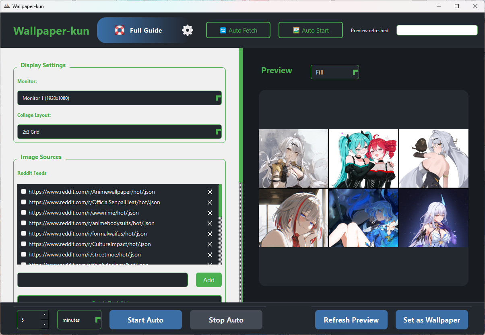

# Wallpaper-kun

<p align="center">
  
</p>

A powerful Windows application for creating dynamic, multi-monitor wallpaper collages from Reddit and Zerochan API sources. Features smart automation, real-time previews, and robust file management—all with a beautiful, modern UI.

---

## Screenshots

Below are some screenshots of Wallpaper-kun in action:

<p align="center">
  
  
  
  
  
  
</p>

---

## Table of Contents

- [Features](#features)
- [Installation](#installation)
- [Directory Structure](#directory-structure)
- [Usage](#usage)
- [Troubleshooting](#troubleshooting)
- [System Requirements](#system-requirements)
- [FAQ](#faq)
- [Contributing & Support](#contributing--support)
- [Credits](#credits)

---

## Features

- **Multi-Source Image Fetching**
  - Download wallpapers from Reddit subreddits and Zerochan API endpoints.
  - Smart daily fetch system with background downloads and progress tracking.
- **Multi-Monitor Support**
  - Independent layouts per monitor.
  - Automatic monitor detection and orientation-aware layouts.
- **Collage & Layout System**
  - Portrait and landscape layouts (single, grid, strips, and more).
  - Intelligent image fitting and aspect ratio preservation.
- **Automation**
  - Auto-fetch new images daily or on demand.
  - Auto-change wallpapers at custom intervals (seconds, minutes, hours).
  - Smart image rotation and persistent settings.
- **Modern UI**
  - Real-time preview of collages.
  - Easy-to-use controls for layout, mode, and monitor selection.
  - System tray integration and notifications.

---

## Installation

1. **Download** the latest release from the [Releases](https://github.com/bironil/Wallpaper-kun/releases) page.
2. **Extract** the files to a folder of your choice.
3. **Move** the app to `C:\Program Files\Wallpaper-kun` for system-wide use (optional).
4. **Run** `Wallpaper-kun.exe`.

> **Note:** On first run, the app will create its data folders in  
> `C:\Users\<YourUser>\AppData\Local\Wallpaper-kun\`
> - You may see a Windows warning that the app is unrecognized or "unsecure." This is because I did not pay $500+ for a Microsoft code signing certificate😆. The app is safe to use—just click "More info" and then "Run anyway" to proceed.

---

## Directory Structure

```
AppData/Local/Wallpaper-kun/
├── Images/                  # Downloaded wallpapers
├── composite_wallpaper/     # Composite/backup wallpapers
├── api_urls.txt             # Zerochan API endpoints
├── reddit_urls.txt          # Reddit feed URLs
├── last_fetch.json          # Download tracking
└── user_settings.json       # App configuration
```

---

## Usage

### First Time Setup

1. **Add Sources:**  
   - Enter Reddit feeds or Zerochan API endpoints in the app `reddit_urls.txt` / `api_urls.txt`.
   - You can also use the official website to easily generate Reddit feeds or Zerochan API links: [Wallpaper-kun Website][website]
2. **Enable Auto-Fetch:**  
   - Toggle auto-fetch for daily updates.
3. **Select Layouts:**  
   - Choose your preferred layout for each monitor.
4. **Configure Timer:**  
   - Set the auto-wallpaper timer if desired.
5. **Add Your Own Images:**  
   - You can load and copy your own images directly into the app's root folder using the UI. The app will automatically detect and use them.

### Daily Operation

- The app checks for new images on startup.
- Downloads happen in the background.
- Preview updates automatically.
- Wallpapers change based on your timer or manual action.

> ⚠️ **Warning:**  
> If auto-fetch is enabled, the app will download and replace all old images in the `Images` folder. Please back up any images you want to keep before enabling auto-fetch.

---

## Updates & Future Versions

For the latest updates, new features, and future releases, visit the official website:  
[Wallpaper-kun Website][website]

---

## Troubleshooting

### Image Issues

- Ensure the `Images` folder has content.
- Check `last_fetch.json` for recent activity.
- Verify URLs in `reddit_urls.txt` and `api_urls.txt`.
- Look for download errors in the app’s status bar.

### Wallpaper/Display Issues

- Confirm your monitors are detected in the app.
- Check that wallpapers are saved in AppData, not the install directory.
- If running from `C:\Program Files`, make sure the app is not blocked by Windows permissions.
- Review the composite wallpaper in `composite_wallpaper/`.

### General Tips

- Use longer timer intervals for better performance.
- Enable background fetch for daily updates.

---

## System Requirements

- Windows 10/11
- No Python required (standalone .exe)
- Internet connection for fetching images
- Sufficient disk space for images

---

## FAQ

**Q: Where are my images and settings stored?**  
A: In `C:\Users\<YourUser>\AppData\Local\Wallpaper-kun\`.

**Q: Can I use my own images?**  
A: Yes! Place your images in the `Images` folder or use the UI.

**Q: Is my data private?**  
A: Yes. All downloads and settings are stored locally.

**Q: How do I update?**  
A: The app will notify you if a new version is available. You can always download the latest version for free from [Wallpaper-kun Website][website]. Your settings and images will be preserved.


---

## Contributing & Support

- To report bugs, please use the [Bug Report template](https://github.com/bironil/Wallpaper-kun/issues/new?template=bug_report.md).
- To request features, use the [Feature Request template](https://github.com/bironil/Wallpaper-kun/issues/new?template=feature_request.md).

---


## Credits

- Built with [PyQt6](https://riverbankcomputing.com/software/pyqt/intro), [Pillow](https://python-pillow.org/), and love for anime wallpapers.
- Reddit and Zerochan are trademarks of their respective owners.

---


Enjoy your dynamic wallpapers! If you like the app, please star the repo or share your setup!

[website]: https://assyrian.pro/Wallpaper-kun
